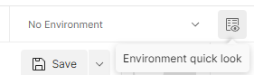
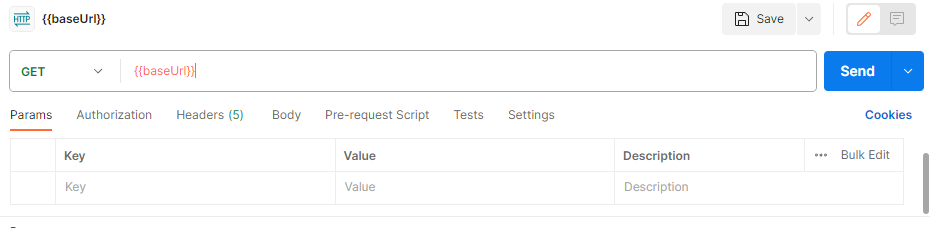
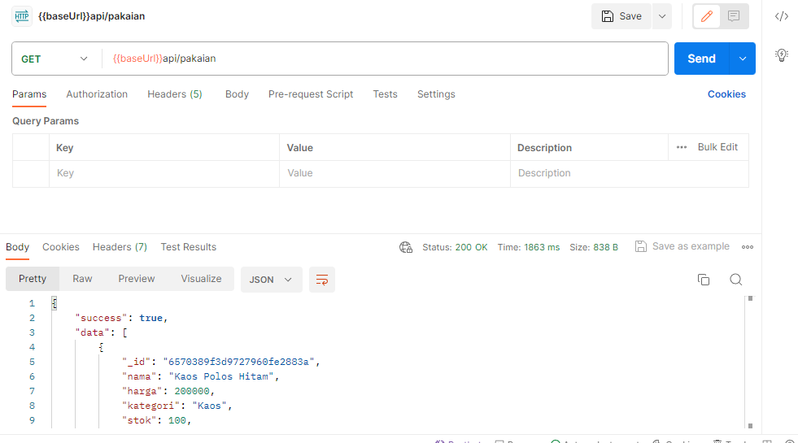

# GAWKFrame - Backend
Selamat datang di bagian Backend untuk GAWKFrame!<br>
GAWKFrame adalah sebuah sistem yang digagas oleh kelompok 12, Tugas Besar Layanan STI (II3120), untuk mendukung e-commerce dari perusahaan yang memakai layanan kami, yakni WovenWears. <br>

# Anggota Kelompok
1. Ivan Aldy Ganesen (NIM 18221045)
2. Laurentia Kayleen Christopher (NIM 18221053)
3. Nazhif Haidar Putra Wibowo (NIM 18221083)
4. Christopher Febrian Nugraha (NIM 18221115)
5. Ferdinand Refrandt (NIM 18221169)

# Penjelasan Penggunaan
Untuk dapat menggunakan API di bawah ini, harap memakai aplikasi Postman. Berikut adalah tata cara penggunaannya:
1. Silahkan mengunduh aplikasi Postman pada [link berikut](https://dl.pstmn.io/download/latest/win64) atau mengunjungi versi webnya pada [link berikut](https://web.postman.co/).
2. Silahkan melakukan register atau login (jika sudah punya akun).
3. Silahkan membuat Workspace baru dengan cara menekan Workspaces -> Create Workspace. Jika tidak ingin, maka akan memakai default Workspace yaitu My Workspace.
4. Buat request baru dengan cara menekan tombol New lalu menekan opsi HTTP.
5. Ganti metode (GET/DELETE/POST) sesuai dengan tipe request yang diinginkan.
6. Di sebelah kanan tulisan "No Environment", terdapat gambar ini. <br>
Tekan tombol `Environment Quick Look`, lalu tekan tombol `Edit` pada barisan `Global`.
7. Masukkan nama variabel `baseURL` dan initial serta current value `https://gawk-frame-be-production.up.railway.app`.
8.  <br>
Silahkan kembali lagi ke request yang sudah dibuat tadi, lalu masukkan terlebih dahulu argumen `{{baseURL}}` seperti ini:<br>

9. Masukkan saja bagian url yang terdapat pada daftar komando di bawah ini (copy paste) ke sebelah kanan `{{baseURL}}`
10. Setelahnya, jika ada query, masukkan kembali di sebelah kanan url yang sudah di-copas sebelumnya, dengan format `?argumen=isi_argumen` (silahkan mengganti argumen dengan variabel, dan isi_argumen dengan isi variabel yang diperlukan).
11. Jika ada body, silahkan pergi ke `Body`, lalu pilih option `Raw` dan ganti tipe `Text` menjadi `JSON`. Isi badan tersebut dengan diselubungi oleh dua kurung siku ```[ ]```.<br>
Contohnya, jika ada userID, maka isi seperti: ```[ userID: "12444" ]```
12. Tekan tombol `SEND`, dan jika berhasil, akan muncul status `200 OK` seperti di bawah ini:<br>



# Daftar Komando
Bagian Backend dari layanan GAWKFrame memberikan layanan API sebagai berikut:
<br>
Pembayaran:
<ul>
<li> method: POST, url: '/api/transaksi', query: userID
<li> method: GET, url: '/api/transaksi', body: pembelian_baju
</ul>

InquiryBaju:
<ul>
<li> method: GET, url: '/api/chat/:userId',
<li> method: POST, url: '/api/chat/:userId', body: sender, message
<li> method: DELETE, url: '/api/chat/:userId', body: messageId
</ul>

PenampilanData:
<ul>
<li> method: GET, url: 'api/pakaian'
<li> method: GET, url: 'api/pakaian/:id'
<li> method: GET, url: 'api/riwayat/:id'
<li> method: GET, url: '/api/keranjang/:id'
<li> method: POST, url: '/api/keranjang/:id', body: bajuId, jumlah
<li> method: DELETE, url: '/api/keranjang/:id', body: id_item
<li> method: GET, url: '/api/pelanggan'
<li> method: GET, url: '/api/pelanggan/:id'
<li> method: POST, url: '/api/pelanggan', body: nama
<li> method: DELETE, url: '/api/pelanggan/:id'
</ul>